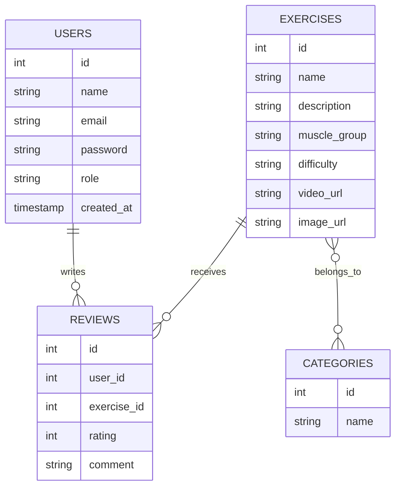
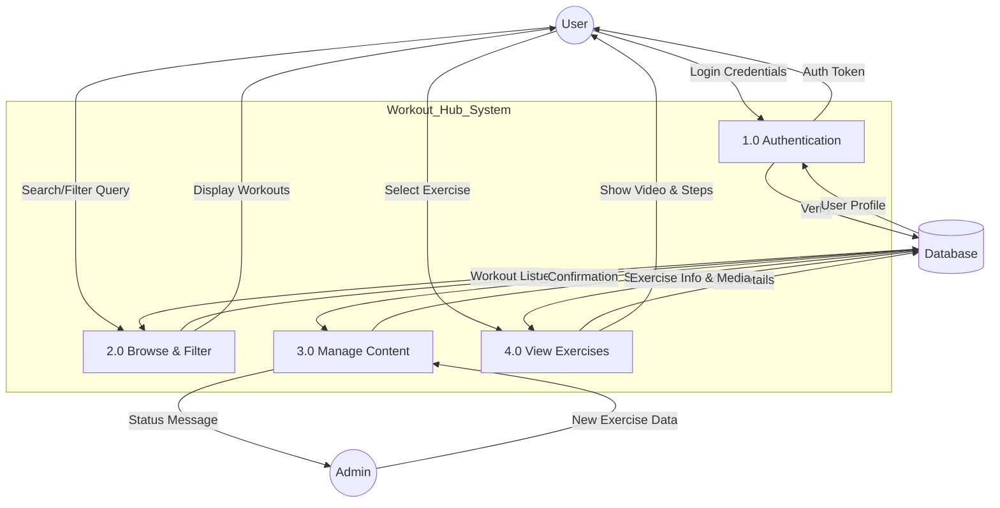

# Workout Hub 2.0 - System Design

## 1. Database Schema (MySQL)

```sql
CREATE DATABASE IF NOT EXISTS workout_hub_2;
USE workout_hub_2;

-- Users Table
CREATE TABLE users (
    id INT AUTO_INCREMENT PRIMARY KEY,
    name VARCHAR(100) NOT NULL,
    email VARCHAR(100) UNIQUE NOT NULL,
    password VARCHAR(255) NOT NULL,
    role ENUM('user', 'admin') DEFAULT 'user',
    created_at TIMESTAMP DEFAULT CURRENT_TIMESTAMP
);

-- Categories Table (e.g., Muscle Groups, Workout Types)
CREATE TABLE categories (
    id INT AUTO_INCREMENT PRIMARY KEY,
    name VARCHAR(50) NOT NULL UNIQUE
);

-- Exercises Table
CREATE TABLE exercises (
    id INT AUTO_INCREMENT PRIMARY KEY,
    name VARCHAR(100) NOT NULL,
    description TEXT,
    muscle_group VARCHAR(50),
    difficulty ENUM('Beginner', 'Intermediate', 'Advanced'),
    video_url VARCHAR(255),
    image_url VARCHAR(255),
    created_at TIMESTAMP DEFAULT CURRENT_TIMESTAMP
);

-- Junction Table: Exercise_Category
CREATE TABLE exercise_category (
    exercise_id INT,
    category_id INT,
    PRIMARY KEY (exercise_id, category_id),
    FOREIGN KEY (exercise_id) REFERENCES exercises(id) ON DELETE CASCADE,
    FOREIGN KEY (category_id) REFERENCES categories(id) ON DELETE CASCADE
);

-- Reviews Table
CREATE TABLE reviews (
    id INT AUTO_INCREMENT PRIMARY KEY,
    user_id INT,
    exercise_id INT,
    rating TINYINT CHECK (rating BETWEEN 1 AND 5),
    comment TEXT,
    created_at TIMESTAMP DEFAULT CURRENT_TIMESTAMP,
    FOREIGN KEY (user_id) REFERENCES users(id) ON DELETE CASCADE,
    FOREIGN KEY (exercise_id) REFERENCES exercises(id) ON DELETE CASCADE
);
```

## 2. Entity Relationship (ER) Diagram



## 3. Data Flow Diagram (DFD) - Level 1


